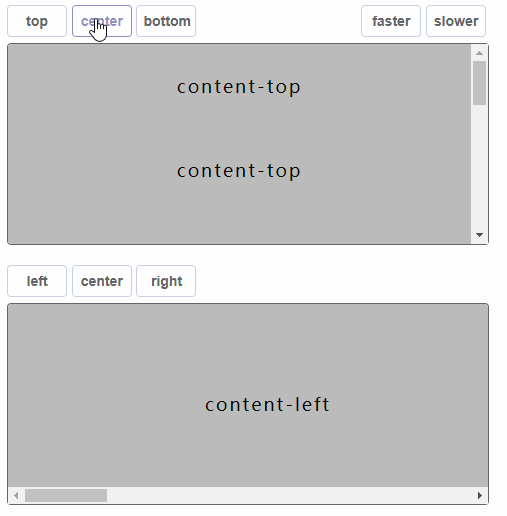

# **scroll-ease-efficient**
 A function that smoothly scroll the scrollbar to the specified position.

 Support two directions：vertical & horizontal.

 Support three animations: gradually & liner & instant


# demo
https://theoxiong.github.io/scroll-ease-efficient/



# install
``` 
$   npm install scroll-ease-efficient 
```

# use
```
// Support CommonJs/ES6/Script 
// 1. CommonJs 
const { scrollTo } = require('scroll-ease-efficient')
// 2. ES6
import { scrollTo } from 'scroll-ease-efficient'
// 3. Script
<script type="text/javascript" src="scroll-ease-efficient/index.js"></script>

// scrollable element
let scrollEle = document.getElementById('id')

// basic usage
scrollTo(scrollEle, 500)

// specify the time of scrolling, unit is millisecond(ms)
scrollTo(scrollEle, 500, { duration: 500})

// specify the timing function, support 'gradually'/'liner'/'instant'
scrollTo(scrollEle, 500, { timingFunction: 'gradually'})

// specify the time of scrolling, and timing function
scrollTo(scrollEle, 500, { timingFunction: 'liner', duration: 500})

// specify the factor, it is just for 'gradually' mode, and duration is unuserful
scrollTo(scrollEle, 500, { timingFunction: 'gradually', factor: 6})

// horizontal direction
scrollTo(scrollEle, 500, { direction: 'horizontal' })
```

# description
**<font size=4>function scrollTo (ele, pos, [options])</font>**
* ele &lt;<font color=#9acd32>Dom</font>&gt; target scrollable element 
* pos &lt;<font color=#9acd32>Number</font>&gt; specified the position which scroll to
* options &lt;<font color=#9acd32>Object</font>&gt; 
   * direction &lt;<font color=#9acd32>String</font>&gt; specify direction of scrolling, default value is 'vertical'
   * timingFunction &lt;<font color=#9acd32>String</font>&gt; specify velocity curve of scrolling, default value is 'linear'
   * duration &lt;<font color=#9acd32>Number</font>&gt; specify time of scrolling, default value is 1000
   * factor &lt;<font color=#9acd32>Number</font>&gt; specify the factor of gradually scrolling, it is only for gradually mode, should less then 100, and more then 1


# obey
MIT
# Keywords
scroll dom js animation front-end web
